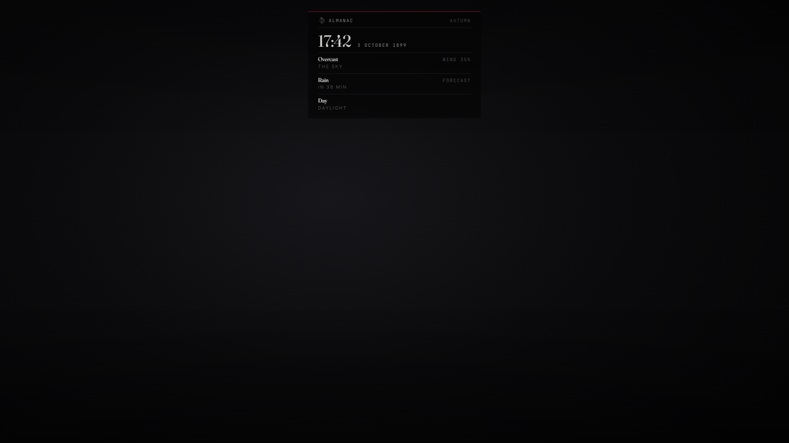

# lxr-weather — One clock and one sky, for LXRCore

The server keeps the calendar (year, month, day, hour, minute) and the sky
(what it is, what comes next, when), publishes both through global state,
and every client mirrors them into the game. Seasons come from the calendar;
the sky follows a seasonal table with real transitions — a thunderstorm
clears through rain, never into snow; the desert never sees a flake. Staff
set, freeze and forecast with core commands; anyone reads the almanac.



## What it does

* **Calendar** — `Config.Clock.start`, `msPerMinute` (faster nights
  optional), persisted in `lxr_weather`; `GlobalState.hour / minute /
  calendar` for every resource (shops and banks read the hour).
* **Seasons** — `Config.Calendar` names each month's season and daylight
  hours; `GlobalState.calendar.season / night`.
* **Sky** — seasonal weight tables, `after` rules for what may follow, hold
  times, a forecast (`weather.next`, `minutesLeft`), wind and snow levels.
* **Clients** — state bag handlers apply the clock (`NetworkClockTimeOverride`)
  and blend the weather over `transitionSeconds`; a 10 s thread keeps the
  desert dry and re-asserts the override.
* **Almanac** — `/almanac` (or a key) shows the time, date, season, sky,
  forecast and daylight on a kit card.
* **Staff** — `/weather <TYPE>`, `/time <h> [m]`, `/freezetime`,
  `/freezeweather` (`lxrcore.admin`).
* **Events** — `lxr:clock:hour (hour, season)`, `lxr:clock:set`,
  `lxr:weather:changed (type, next, reason)`.

## Install

```cfg
ensure lxr-core
ensure lxr-weather
```

## Configuration

`config.lua` — `Config.Lang`, `Config.Clock`, `Config.Calendar`,
`Config.Weather` (seasons, after, wind, snow, desert swap), `Config.Almanac`,
`Config.Security`.

## API

| Name | Side | Purpose |
|---|---|---|
| `GetCalendar()` · `GetWeather()` · `Season()` · `IsNight()` | both | read the truth |
| `SetWeather(type)` · `SetTime(h, m)` · `FreezeTime(on)` · `FreezeWeather(on)` | server | staff and scripted scenes |
| `Almanac()` | client | show the card |
| `GlobalState.hour / minute / calendar / weather` | both | replicated state |

## Licence

© 2026 iBoss21 / LXRCore — All Rights Reserved. See `LICENSE`.
